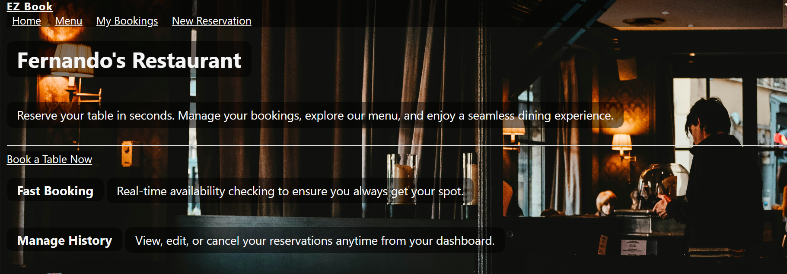

# EZ_Book 

EZ book is a resaurant booking system that delivers an easy straight forward way to reserve a table at different restaurants.
With a simple user-friendly layout customers can view the menu, book a table and view my booking's.
With easy booking and editing to your existing booking's you can easily adjust or cancel.
Users are taken to a booking confirmation page after booking is complete.

### User Goals

User friendly navigation.
Non distracting background.
Opportunity to provide feedback.
Clear instructions written in plain English.

### User Stories

As a user, I want to see the most up to date menu.
As a user, I want to be able to pick a date and time that is suitable.
As a user, I 
As a user, I want to be able to easily contact content creators for feedback or changes.
As a user, I want the content to be accessible for anyone with diverse needs.

### Website goals and objectives

Provide an easy way to book a table, and view the menu.

### Target Auidience

People looking at restaurants to book.
Casual viewers

### Wireframes

Wireframes were designed using balsamiq tool. Following best practices, mobile version was designed first, then tablet and lastly laptop view.

### Design Choices 

Typography

### Images

### Responsiveness

My website is responsive to different layouts depending on the size of the layout. This allows visitors to experience the website as I intended on device types and screen sizes.

### Features

### Existing Features

### Feedback

### Landing View

### Menu View

### Booking View

### 404 Page

### Future Enhancements

### Technologies Used

### Colour Scheme

### Images

### Testing

### Bug Status Description Steps to resolve

### Responsiveness Tests

### Final Test Results:

### Code Validation

### User Story Testing

### Automated and Manual Testing

### Feature Testing

### Accessability Testing

### WAVE

### Lighthouse Testing

### Browser Testing

### Deployment

### Feedback, Advice and Support

### Code Inspiration and Learning Content

### Visual Content

### Images

